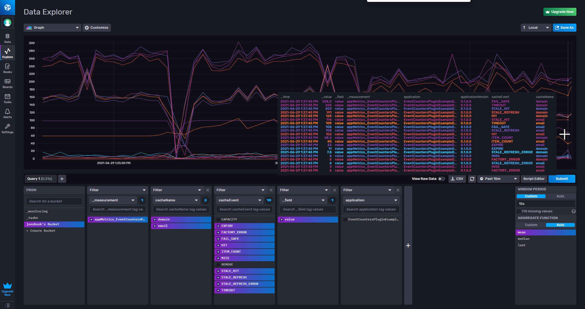

# Example usage of FusionCache.EventCounters.Plugin

## EventCountersPluginExampleDotNetCore is an example project using the FusionCache.EventCounters.Plugin to plugin to [FusionCache](https://github.com/jodydonetti/ZiggyCreatures.FusionCache)

The example is built to produce all events [FusionCache](https://github.com/jodydonetti/ZiggyCreatures.FusionCache) could produce so a user of the plugin can get an understanding of how to use this plugin and what metrics to expect.  This particular example can report to the console, Influx Database or Influx Cloud.  Influx Cloud is very easy to setup and is recomended to get a good visual of the metrics.  See the end of this doc for guidance.  We will also be using [SuperBenchMarker](https://github.com/aliostad/SuperBenchmarker) to produce a load for observing metrics.

## Use Case

The fictisious web service is resolving email address information.  Think of it like a partial SMTP resolution process.  There are two parts to the resolution.  

### Part one

One is domain which is the host part of email address.  This is checked first.  A cache called "domain" cache domain data and a FusionCacheEvenSource plugin instance will collect metrics.  A DataManager will lookup data in the MockDomainCertData.json file representing a database access strategy.  In the `Datamanager.GetDomain` method there are some artificial random delays and excetptions that will produce all of the [FusionCache](https://github.com/jodydonetti/ZiggyCreatures.FusionCache) events.  Note not all Domains are enabled as one can see from the mock data.  

### Part two

The second is email.  If a domain was found and it is enabled then a email address can then be found wich after all is what the load test harness will be testing.  Email is represented as another cache called "email" and another instance of FusionCacheEventSource plugin for tracing metrics independent of "domain".  The `DataManager.GetEmailRoute` method has the same artificial random delays and errors that `DataManager.GetDomain` has.

## Test the example application

In the [superbenchmarker](./tree/main/examples/superbenchmarker) folder there are example launchers for all the sample projects.  For a good demonstration of as many metrics as possible we will load the example applications with two simultanious loads.  A 
faster load test" will tend to request a bucket of similar data in a short enough time period that the FusionCache will never expire the cached data.  While the "slower load test" will request at a slow enough pace we will still be able to see MISS and EXPIRE events.  

### Faster load test
`sb -u "http://localhost:5000/EmailValidator/EmailRoute/{{{email}}}"  -f EmailAddressDataSmallBatch.csv -U -c 8 -y 100 -N 6000 -P 1`

### Slower load test
`sb -u "http://localhost:5000/EmailValidator/EmailRoute/{{{email}}}"  -f EmailAddressDataSmallBatch2.csv -U -c 1 -y 500 -N 6000 -P 1`

So start you app and detatch from the debugger.  Then start the two previous SuperBenchMarker commands.  Test data is in superbenchmarker folder.  The -c 8 is a concurrency of 8.  I have 16 virtual cores and this was plenty to produce interesting metrics data.  -N 6000 means run for 6000 seconds.  -P is how often SuperBenchMarker samples for it's own report.  -y is a delay in ms between concurrent calls.

The image below is an example of the metrics this example and it's configuration will produce.  The FusionCache options have been tunned in cooperation with the sample load tests setups to produce an interesting collection of metrics for this discussion.  Based on your computer getting the exact same behavior may have to be tunned.  

### Resiliency via fail-safe

The FusionCache fail-safe offers resiliency to slow networks and network outages.  Data requested within the fail-safe `FailSafeMaxDuration` can be returned to a caller even if the cache `Duration` is much shorter.  Think about it this way.  If a we have an outage for 5 minutes or 1 hour for that matter, or longer and our FusionCache fail-safe duration is 2 hours, any data that has been cached in the last 2 hours can be used even if we only intend our cache duration to last 5 seconds or 5 minutes.  The example does not deal in minutes and hours, or days because it is trying to produce a demonstration of caching metrics.  

Below we can see metrics that indicate we are relying heavily on the fail-safe feature.  There are a few metrics in there all related to fail-safe.  Specifically STAIL_HIT, FAIL_SAFE and TIMEOUT.  Practically speaking STALE_HIT would be as usefull as the others and unless you are a FusionCache developer it is the recomended metric to track.  The other two are HIT and MISS.  This leaves STALE_REFRESH, STALE_REFRESH_ERROR AND FACTORY_ERROR.  STALE_REFRESH indicates while we timed-out refreshing a cache entry and returned a stale value, in the background the cache was finally updated.  Related is STALE_REFRESH_ERROR which means the background refresh threw and error.  And then there is FACTORY_ERROR which means the function passed to `GetOrSet` threw and error.  

Study the DataManager in the samples and you will see that we randomly inject delays and errors to produce the interesting results.  

### EXPIRE Events from MemoryCache Eviction

If you study the FusionCache options the expectation would be that every 30 seconds a cache items would expire.  But it seems that MemoryCache collects about every one minute and that is when it runs the eviction process.  

## Connect to Influx Cloud

You can easily create a free account on [Influxdata Cloud](https://cloud2.influxdata.com/signup).  Then you would need the following in your appsettings.json or secrets.json file:

`[

    "InfluxCloudConfig.Url": https://us-central1-1.gcp.cloud2.influxdata.com,

    "InfluxCloudConfig.Token": "Get from Influx | Data | Tokens",

    "InfluxCloudConfig.Bucket": "Get from Influx | Data | C# | Initialize the Client example",

    "InfluxCloudConfig.Organization": “Get from Influx | Data | C# | Initialize the Client example”
]`
